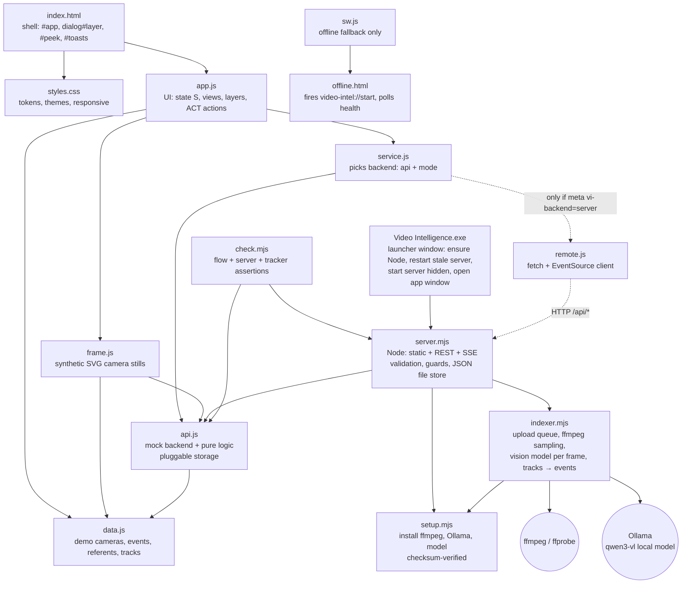
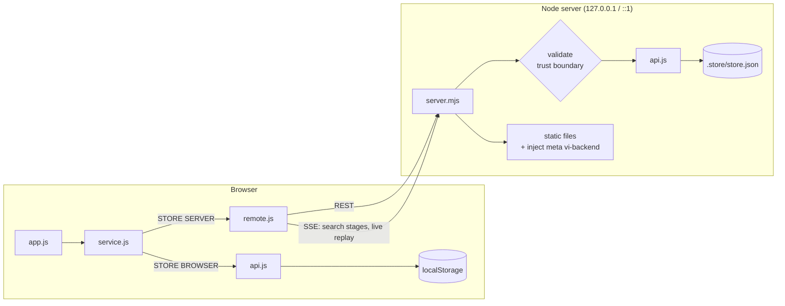
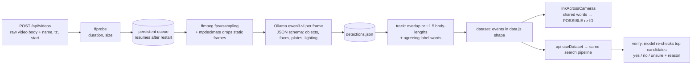
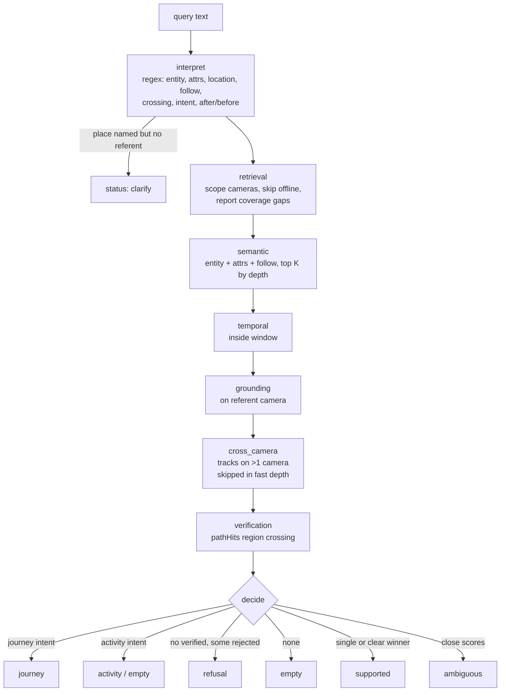
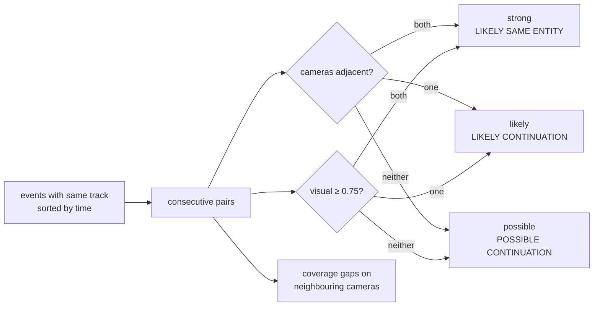
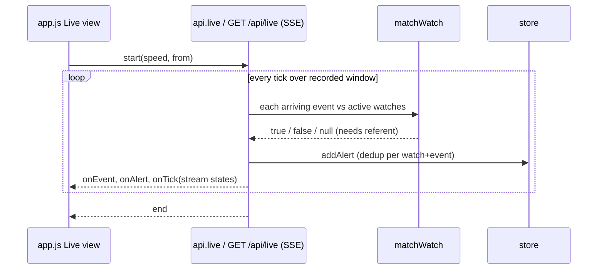
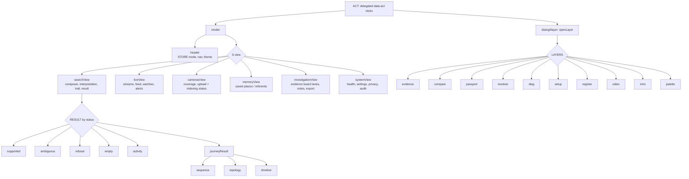
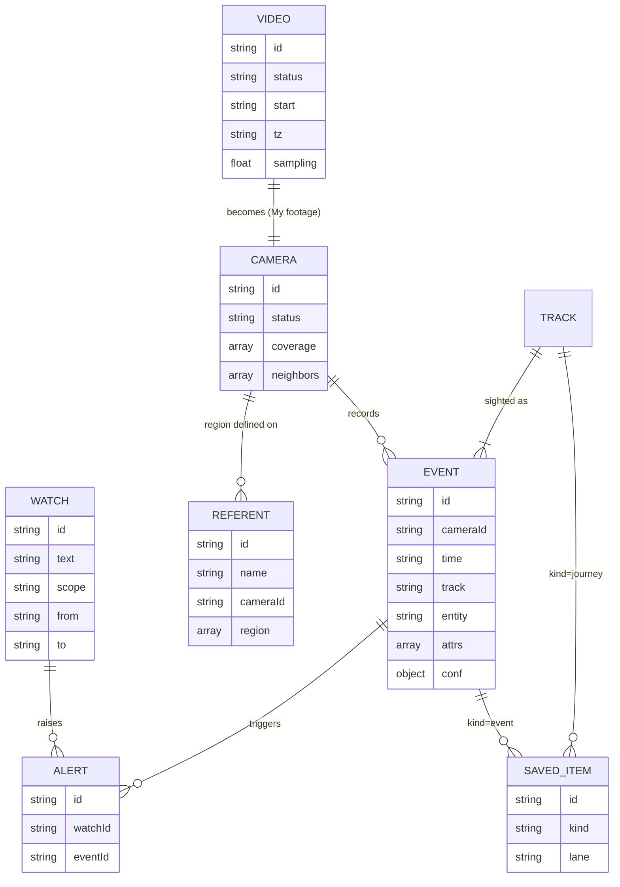

# Architecture graphs

Visual map of the codebase. See `HANDOFF.md` for the prose version and change log.

## 1. Module dependency graph

## 2. Runtime modes

Static hosting (`python -m http.server`) never injects the meta tag, so the browser runs `api.js` directly against `localStorage`, and only the demo dataset is available.

## 2b. Indexing your own footage (`indexer.mjs`)

## 3. Search pipeline (`api.search`)

Each stage emits through `onStage` (SSE on the server). Every result carries `funnel`, `coverage`, `rejected` and `diag`.

## 4. Re-identification and journeys (`api.journey`)

## 5. Live replay, watches and alerts

## 6. UI structure (`app.js`)

## 7. Data model

In "My footage" mode each indexed `VIDEO` becomes a `CAMERA`, and its tracks become `EVENT`s in the same shape as the demo data.
