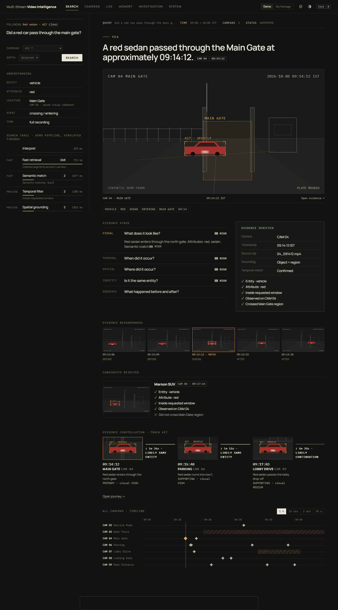
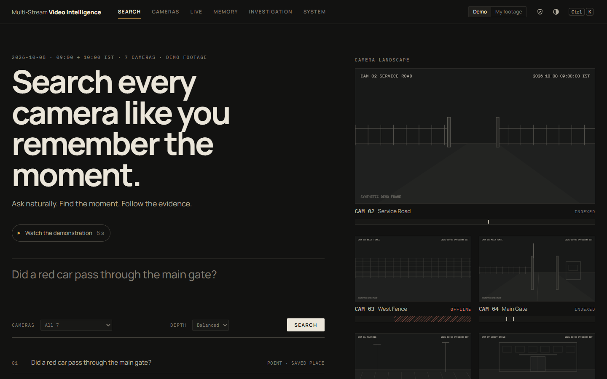
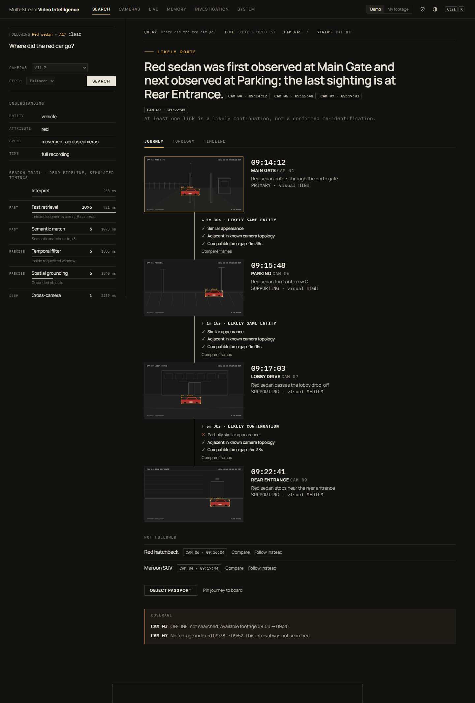
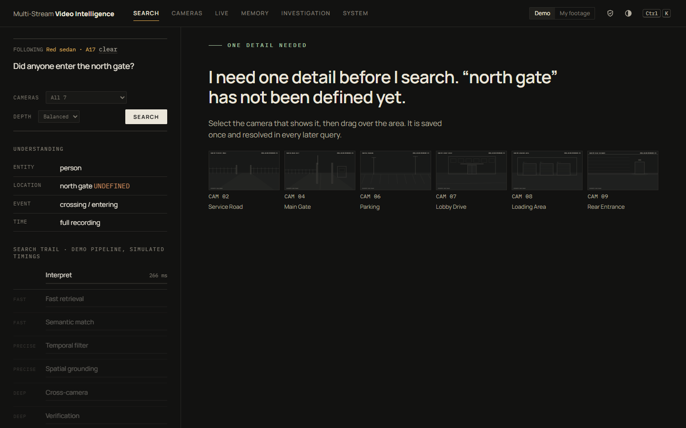
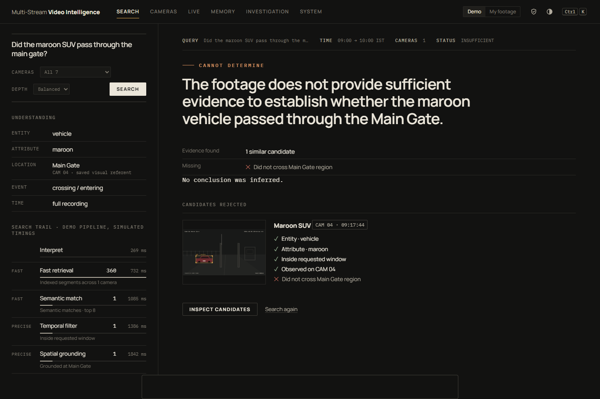
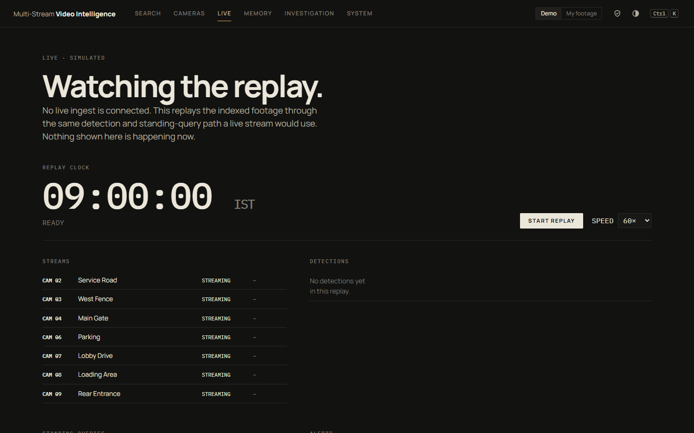
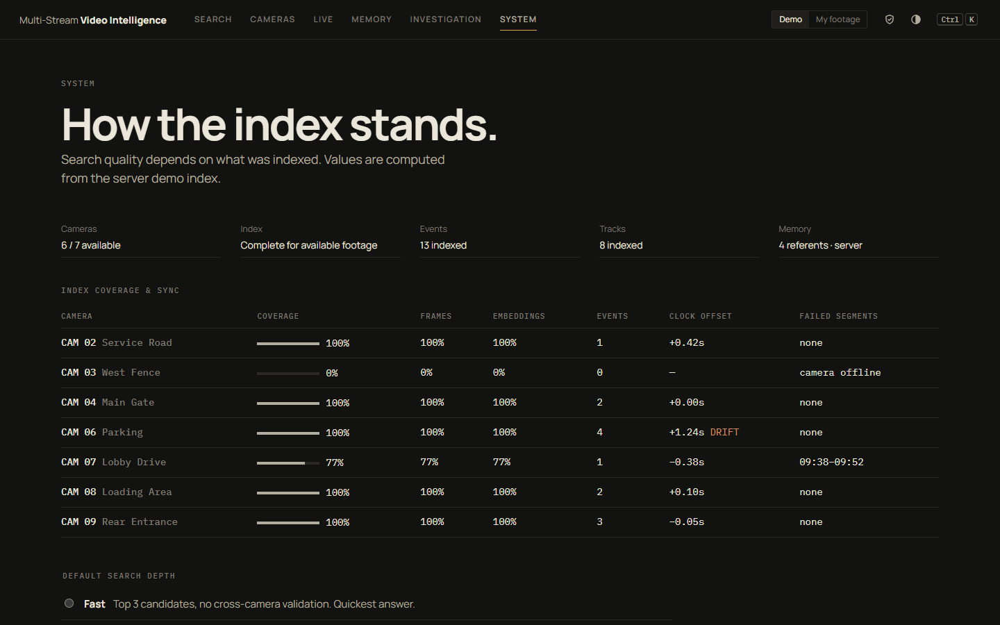
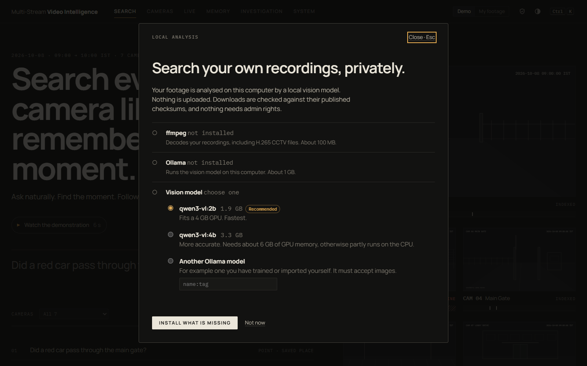
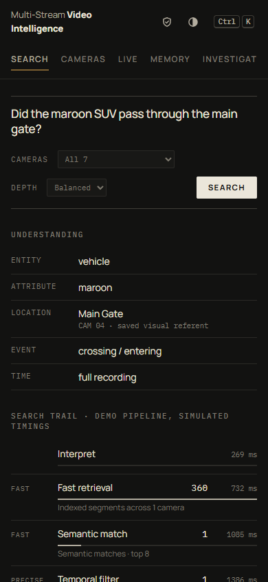
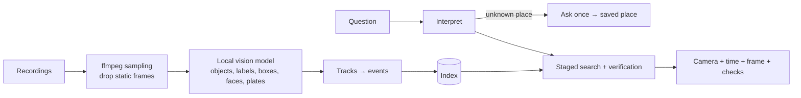

# Multi-Stream Video Intelligence

Ask questions about recorded multi-camera footage in plain English — *"Did a red car pass through the main gate?"* — and get back **which camera, when, and the visual evidence**, with the reasoning shown.

Built for problem statement **HNX26EPS05: Multi-Stream Video Intelligence with Conversational Query**. Everything runs locally: no cloud calls, no npm dependencies.



## What it does

| Capability | How |
|---|---|
| Natural-language search | Query is interpreted into entity, attributes, place, time window and intent, then narrowed stage by stage (retrieval → semantic → temporal → grounding → cross-camera → verification). Each stage streams to the UI. |
| Grounded answers | Every answer cites camera + timestamp + frame, with the checks that passed or failed. If the evidence is not enough, it says so instead of guessing. |
| Clarify once, then remember | An unknown place ("north gate") triggers one question: pick the camera and drag over the area. The place is saved on the server and reused in every later query, across restarts. |
| Cross-camera journeys | Sightings of the same entity are chained into a route. Links are rated *likely same entity / likely continuation / possible continuation*, never stated as fact, and camera coverage gaps are always reported. |
| Your own footage | Upload recordings; they are indexed on this computer by a local vision model (Ollama `qwen3-vl:2b` by default) and searched with the same pipeline. |
| Standing queries & alerts | "Notify me if anyone enters the rear entrance after 20:00" — evaluated against events as a recording is replayed. |
| Privacy | Face and plate masking, retention and expiry limits, operator roles, and an audit trail for every reveal. |

## Screenshots

| | |
|---|---|
|  **Search** |  **Cross-camera journey** |
|  **Asks once about an unknown place** |  **Refuses when evidence is insufficient** |
|  **Replay with standing queries** |  **Index coverage and sync** |
|  **Local analysis setup** |  **Mobile layout** |

## Quick start

Requires Windows for the one-click launcher; Node.js 18+ anywhere else.

```bash
# Windows, one click: installs Node if needed, starts the server on :8000, opens the app window
Start.cmd

# Any OS
npm start                    # http://localhost:8000  (PORT, VI_STORE env vars)

# Tests: search flows, server validation, SSE, persistence, tracker, and (with ffmpeg) a full index run
npm run check
```

ES modules need an http origin, so opening `index.html` from disk does not work. `python -m http.server` also works, but only the demo dataset is available without the Node server.

### Searching your own footage

1. Start the server. On first launch a setup dialog offers to install **ffmpeg**, **Ollama** and a vision model (per-user, checksum-verified, no admin rights).
2. Switch the header to **My footage** and upload videos on the **Cameras** page with a name, timezone and start time.
3. Indexing runs in the background (resumes after a restart). On an RTX 3050 4 GB, `qwen3-vl:2b` takes about 5 s per sampled frame at 0.5 fps.

## Two data sources

- **Demo**: a synthetic one-hour, seven-camera dataset (`data.js`), labelled *SYNTHETIC DEMO FRAME* everywhere. Search timings in this mode include simulated delays.
- **My footage**: your recordings, indexed locally by `indexer.mjs`. No simulated delays; the top candidates are re-checked by the vision model before an answer is given.

## How it works



Detailed diagrams (modules, runtime modes, search pipeline, re-ID, alerts, UI, data model) are in [ARCHITECTURE.md](ARCHITECTURE.md). Per-file responsibilities, design rules and the full change log are in [HANDOFF.md](HANDOFF.md).

## Project layout

| File | Role |
|---|---|
| `app.js`, `index.html`, `styles.css` | UI (vanilla JS, string-template views) |
| `api.js` | Search pipeline, journeys, memory, watches; runs in the browser or on the server |
| `service.js`, `remote.js` | Picks the backend; REST + SSE client for the server |
| `server.mjs` | Node HTTP server: static files, REST, SSE, input validation, loopback-only binding |
| `indexer.mjs` | Upload queue, frame sampling, vision model calls, tracking, cross-camera linking |
| `setup.mjs` | Installs ffmpeg, Ollama and the model |
| `data.js`, `frame.js` | Demo dataset and frame rendering |
| `Start.cmd`, `start.ps1`, `launcher.cs` | Windows launcher (no console window) |
| `sw.js`, `offline.html`, `manifest.webmanifest` | Installable app; restarts the server from the app icon |
| `check.mjs` | Test suite |

## Known limitations

- **Query understanding is keyword-based.** The interpreter matches a fixed word list plus every word in the index. Queries using words the vision model never wrote down will miss.
- **No embedding retrieval yet.** Matching is on model-written descriptions, not vision-language embeddings.
- **Sparse sampling.** At 0.5 fps one person can split into several tracks.
- **Cross-camera links are description-based** and always shown as *possible*.
- **No baseline comparison or ablation yet.**
- **Live mode replays indexed footage**; there is no RTSP ingest.
- **Masking depends on the model** reporting faces and plates, which it often misses for distant CCTV figures.
- **No authentication**: the operator role is a setting.

## Development history

| Commit | Change |
|---|---|
| `e459c5d` | Core loop: search, evidence, journeys, saved places |
| `61cc21f` | Light/dark theme, contextual cursor |
| `46f9f87` | Node backend with REST, SSE search stages, file persistence |
| `2f271da` | Search depth, diagnostics, System page |
| `65b9219` | Privacy controls, roles, audited reveal |
| `5789e60` | Simulated live mode, standing queries, alerts |
| `bd38b3e` | Footage import and camera registration |
| `edb1e14` | Evidence board, pinned journeys, frame comparison |
| `8f7f7ad` | Opening demonstration |
| `e0557da` → `0460457` | One-click launcher, installable app, icon starts the server |
| `e7b78f4` | Windowless launcher, request guards (Host, Origin, content-type) |
| `5dfc129` | **Index and search your own recordings with a local vision model** |
