# Multi-Stream Video Intelligence

Ask questions about recorded multi-camera footage in plain English — *"Did a red car pass through the main gate?"* — and get back **which camera, when, and the visual evidence**, with the reasoning shown.

Built for problem statement **HNX26EPS05: Multi-Stream Video Intelligence with Conversational Query**. Everything runs locally: no cloud calls, no npm dependencies.

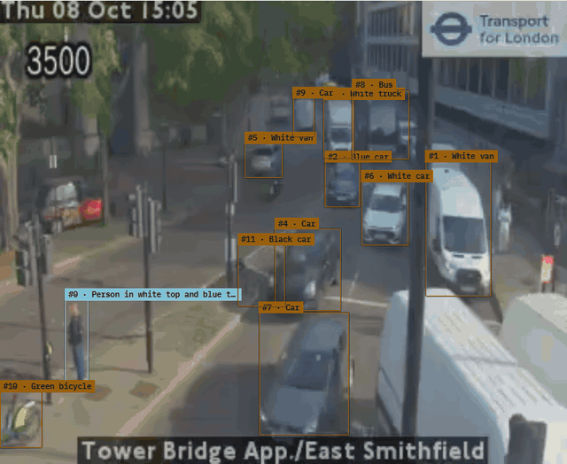

*Real footage: a TfL JamCam at Tower Bridge Approach, indexed on a laptop (RTX 3050, 4 GB). Every object is found by the detector, followed between frames, and named once by the local vision model.*

## What it does

| Capability | How |
|---|---|
| Natural-language search | Query is interpreted into entity, attributes, place, time window ("in the last hour", "between 9 and 9:30") and intent, then narrowed stage by stage (retrieval → semantic → temporal → grounding → cross-camera → verification). Each stage streams to the UI. |
| Open vocabulary | Every tracked object has a MobileCLIP image embedding as well as a short description, so words no label contains ("delivery box", "large bag") still find it. Each answer points at the moment the query best matches. |
| Grounded answers | Every answer cites camera + timestamp + frame, with the checks that passed or failed, and a downloadable 10 s clip. If the evidence is not enough, it says so instead of guessing. |
| Clarify once, then remember | An unknown place ("north gate") triggers one question: pick the camera and drag over the area. The place is saved on the server and reused in every later query, across restarts. |
| Cross-camera journeys | Sightings of the same entity are chained into a route when their crops look alike (MobileCLIP), share a colour and fit in time. Links are rated *likely same entity / likely continuation / possible continuation*, never stated as fact, and camera coverage gaps are always reported. |
| Your own footage | Upload recordings (many at once with a `manifest.csv` of cameras and start times), capture public live cameras periodically or continuously, or import the MEVA archive. Indexed on this computer: YOLOX-S detection and tracking at 5 fps, each object named once by a local vision model (Ollama `qwen3-vl:2b`), MobileCLIP embeddings. |
| Playback with detections | Play any indexed recording with its tracked objects boxed and labelled, or switch to the original picture. H.265 and other codecs browsers cannot play get an H.264 copy during indexing. |
| Standing queries & alerts | "Notify me if anyone enters the rear entrance after 20:00": checked against every recording as it finishes indexing (uploads, live captures, imports). |
| Privacy | Face and plate masking, retention and expiry limits, operator roles, and an audit trail for every reveal. |

## Results

On 43 queries with known answers over 13 cameras (27 from MEVA's official activity annotations, 16 hand-labelled),
against a standard CLIP frame-retrieval baseline on the same footage:

| | Hit@1 | Hit@5 | MRR | Median time error |
|---|---|---|---|---|
| Baseline: CLIP frame retrieval | 30.2% | 46.5% | 0.363 | 3.5 s |
| This system | **41.9%** | **76.7%** | **0.544** | **0.5 s** |

The gain is on activities (Hit@5 29.6% to 70.4%); on simple appearance queries the baseline is as good at Hit@1. Method,
ablation, held-out split, latency and limitations are in **[WRITEUP.md](WRITEUP.md)**; reproduce with `node eval/eval.mjs`.

In the app, every answer shows the baseline's top 5 beside it, and when the question is one of the 43 both are marked
right or wrong against the labelled answer. The System page shows this table.

## Screenshots

All from real public camera footage (TfL JamCams, London) indexed on this computer.

| | |
|---|---|
| 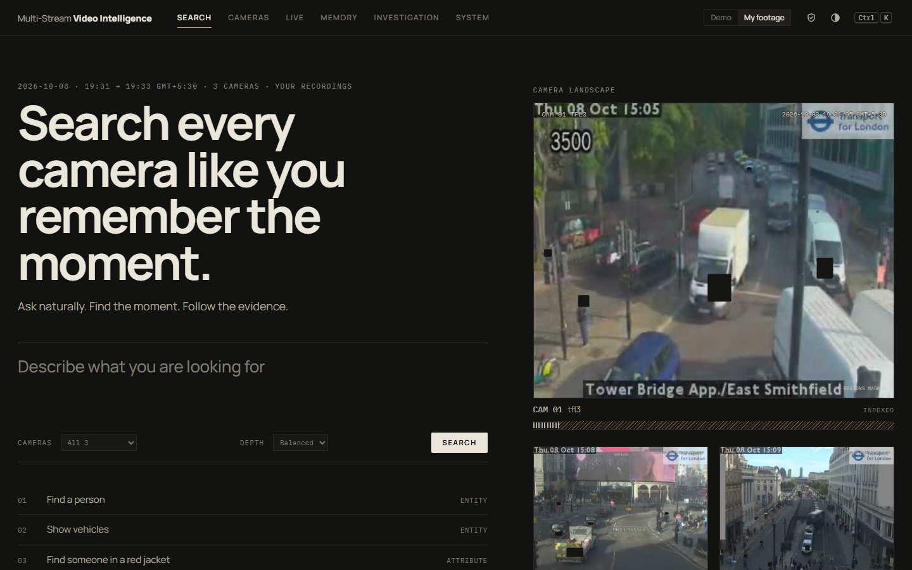 **Search your cameras** | 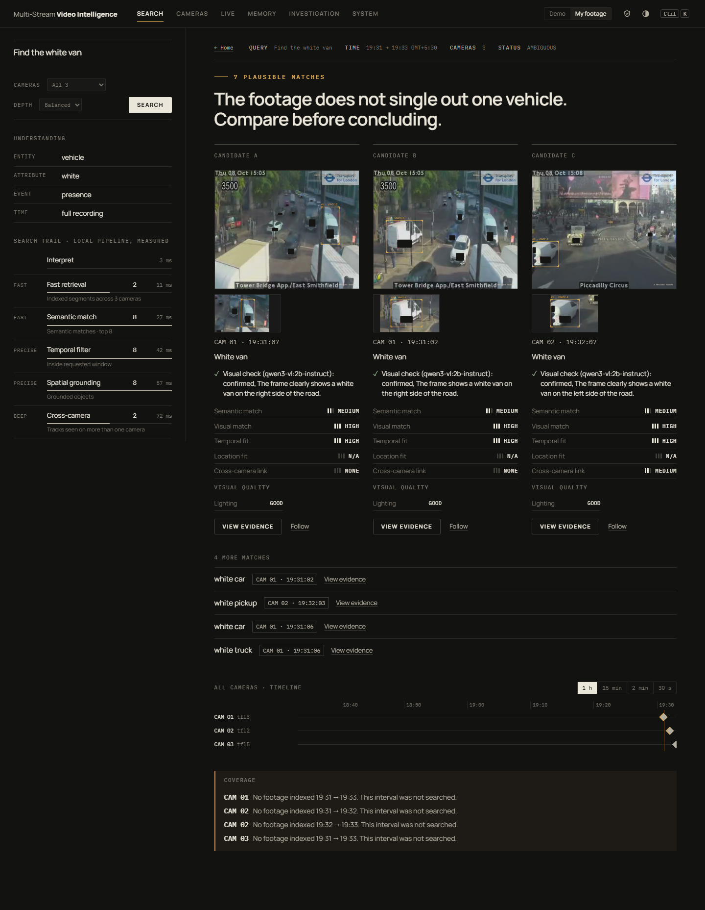 **"Find the white van": candidates, each visually checked by the model** |
| 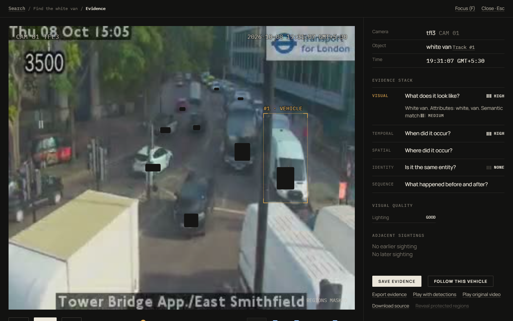 **Evidence: frame, object, time and the checks behind it** | 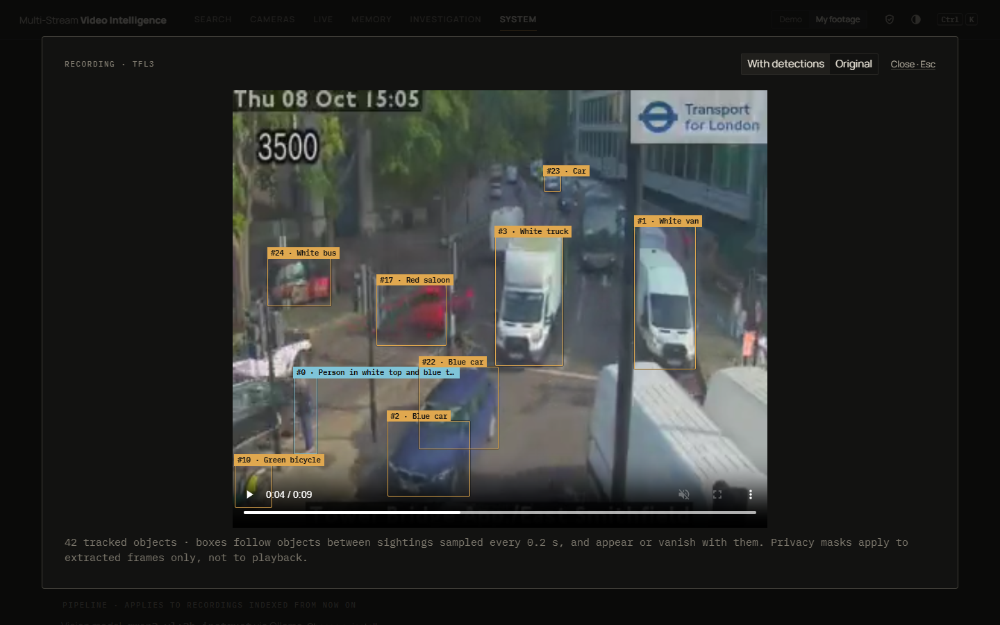 **Playback with every tracked object boxed and labelled** |
| 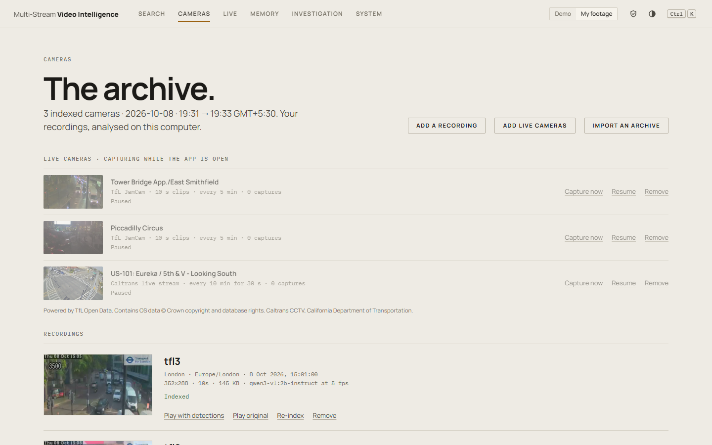 **Live public cameras and indexed recordings** | 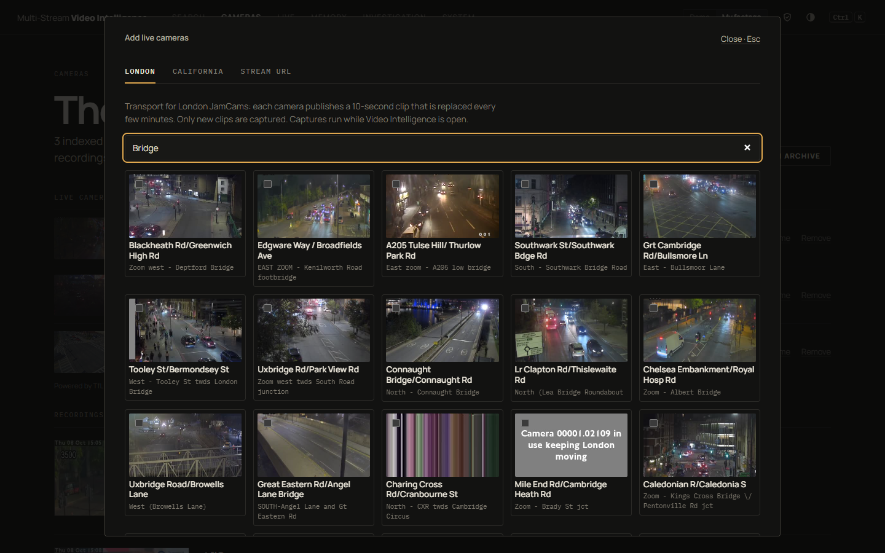 **Pick from ~890 London and California cameras** |
| 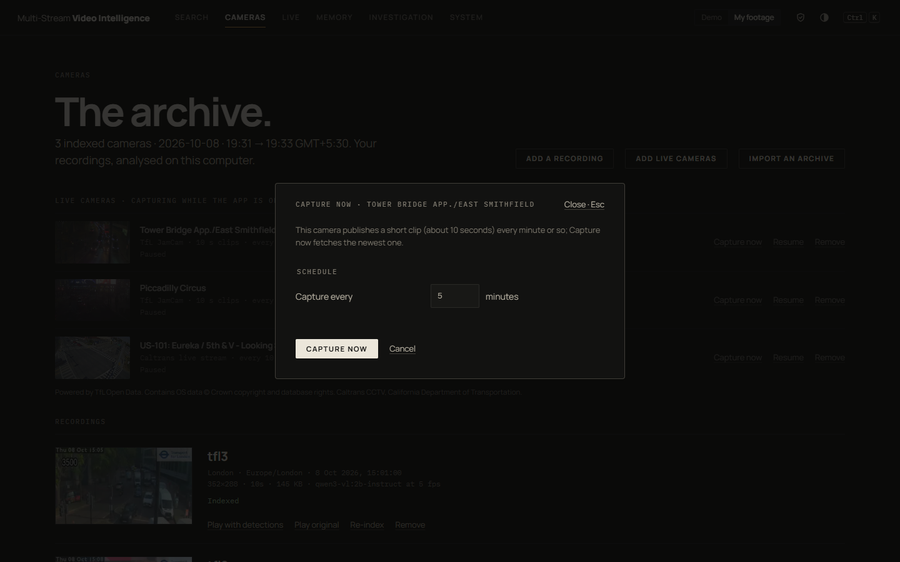 **Capture now, for as long as you choose** | 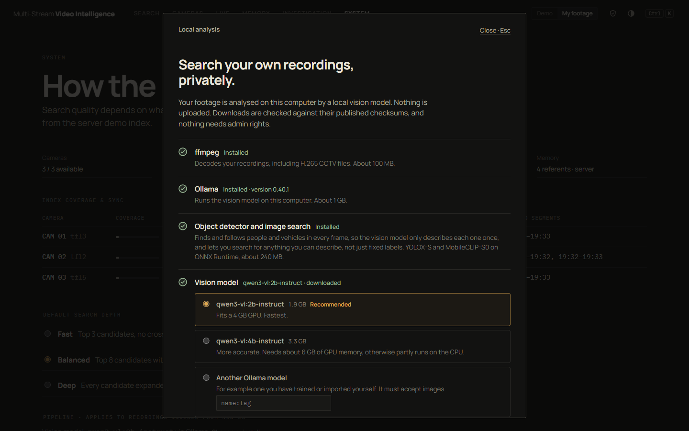 **One-click local setup: ffmpeg, Ollama, detector, model** |
| 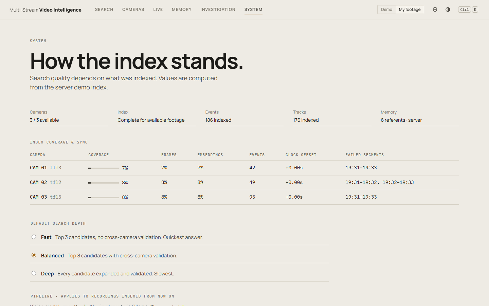 **Index coverage, search depth, privacy** | |

The app also ships a synthetic seven-camera demo (the **Demo** switch in the header) for trying it without footage.

## Quick start

**Windows:** open **`Video Intelligence.exe`**. A small launcher window installs a private Node.js if needed (checksum-verified, no admin), starts the local server and opens the app. No console window appears. If an outdated server from before a `git pull` is still running, the launcher restarts it.

Other systems need Node.js 18+:

```bash
# Any OS
npm start                    # http://localhost:8000  (PORT, VI_STORE env vars)

# Tests: search flows, server validation, SSE, persistence, tracker, and (with ffmpeg) a full index run
npm run check
```

ES modules need an http origin, so opening `index.html` from disk does not work. `python -m http.server` also works, but only the demo dataset is available without the Node server.

### Searching your own footage

1. Start the server. On first launch a setup dialog offers to install **ffmpeg**, **Ollama** and a vision model (per-user, checksum-verified, no admin rights).
2. Switch the header to **My footage** and upload videos on the **Cameras** page with a name, timezone and start time.
3. Indexing runs in the background (resumes after a restart). An object detector (YOLOX-S, installed by the same setup) finds and follows people and vehicles in every frame at 5 fps, and `qwen3-vl:2b` describes each one once: about 2.5-4 s of work per second of busy footage on an RTX 3050 4 GB.

### Where to get footage

| Source | What | Access |
|---|---|---|
| [TfL JamCams](https://api.tfl.gov.uk/Place/Type/JamCam) | ~890 London traffic cameras, ~10 s MP4 clips refreshed every few minutes | Free, no key |
| [Caltrans CCTV](https://cwwp2.dot.ca.gov/documentation/cctv/cctv.htm) | California highway cameras; many with live HLS streams ffmpeg can record | Free, no key |
| [MEVA](https://mevadata.org) | ~330 h, 29 overlapping and non-overlapping cameras, people and vehicles, annotated | `aws s3 ls --no-sign-request s3://mevadata-public-01/` |
| [WILDTRACK](https://www.epfl.ch/labs/cvlab/data/data-wildtrack/) | 7 overlapping HD cameras, pedestrians, calibrated | Free download |
| CamNeT | 5-8 non-overlapping campus cameras with trajectories | Research dataset |

TfL, Caltrans, any HLS/RTSP/MP4 stream URL, MEVA and plain video-URL lists are built in: **Cameras → Add live cameras / Import an archive**. Live cameras are captured as short clips on an interval while the app is open; each camera's clips are searched as one camera, one day at a time (pick the day in the header). Details and caveats are in [HANDOFF.md](HANDOFF.md#footage-sources-researched).

## Two data sources

- **Demo**: a synthetic one-hour, seven-camera dataset (`data.js`), labelled *SYNTHETIC DEMO FRAME* everywhere. Search timings in this mode include simulated delays.
- **My footage**: your recordings, indexed locally by `indexer.mjs`. No simulated delays; the top candidates are re-checked by the vision model before an answer is given.

## How it works

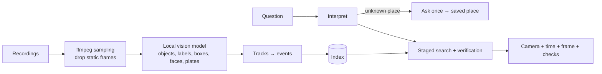

Detailed diagrams (modules, runtime modes, search pipeline, re-ID, alerts, UI, data model) are in [ARCHITECTURE.md](ARCHITECTURE.md). Per-file responsibilities, design rules and the full change log are in [HANDOFF.md](HANDOFF.md).

## Project layout

| File | Role |
|---|---|
| `app.js`, `index.html`, `styles.css` | UI (vanilla JS, string-template views) |
| `api.js` | Search pipeline, journeys, memory, watches; runs in the browser or on the server |
| `service.js`, `remote.js` | Picks the backend; REST + SSE client for the server |
| `server.mjs` | Node HTTP server: static files, REST, SSE, input validation, loopback-only binding |
| `indexer.mjs` | Upload queue, frame sampling, vision model calls, tracking, cross-camera linking |
| `setup.mjs` | Installs ffmpeg, Ollama and the model |
| `data.js`, `frame.js` | Demo dataset and frame rendering |
| `Video Intelligence.exe`, `launcher.cs`, `icon.ico` | Windows launcher window (source, build command inside `launcher.cs`) |
| `sw.js`, `offline.html`, `manifest.webmanifest` | Installable app; restarts the server from the app icon |
| `check.mjs` | Test suite |

## Known limitations

- **Query understanding is keyword-based.** The interpreter matches a fixed word list plus every word in the index. Queries using words the vision model never wrote down will miss.
- **No embedding retrieval yet.** Matching is on model-written descriptions, not vision-language embeddings.
- **Sparse sampling.** At 0.5 fps one person can split into several tracks.
- **Cross-camera links are description-based** and always shown as *possible*.
- **No baseline comparison or ablation yet.**
- **Live is as fresh as the last indexed clip.** Live cameras are captured as periodic clips (or continuous segments for streams), and only while the app is open.
- **Indexing runs at about 2.5-4x real time** on a 4 GB GPU with the object detector (5 fps; busy scenes take longer), or 2-3x at 0.5 fps without it. Capture pauses while 12 clips wait; big archives take hours.
- **Masking depends on the model** reporting faces and plates, which it often misses for distant CCTV figures.
- **No authentication**: the operator role is a setting.

## Development history

| Commit | Change |
|---|---|
| `e459c5d` | Core loop: search, evidence, journeys, saved places |
| `61cc21f` | Light/dark theme, contextual cursor |
| `46f9f87` | Node backend with REST, SSE search stages, file persistence |
| `2f271da` | Search depth, diagnostics, System page |
| `65b9219` | Privacy controls, roles, audited reveal |
| `5789e60` | Simulated live mode, standing queries, alerts |
| `bd38b3e` | Footage import and camera registration |
| `edb1e14` | Evidence board, pinned journeys, frame comparison |
| `8f7f7ad` | Opening demonstration |
| `e0557da` → `0460457` | One-click launcher, installable app, icon starts the server |
| `e7b78f4` | Windowless launcher, request guards (Host, Origin, content-type) |
| `5dfc129` | **Index and search your own recordings with a local vision model** |
| `720dcbf` | H.265 and other non-browser codecs become playable |
| `f693ad3` | Playback with tracked boxes, page transitions, new scrollbar |
| — | Launcher window replaces `Start.cmd`; outdated servers are restarted; setup dialog restyled |
